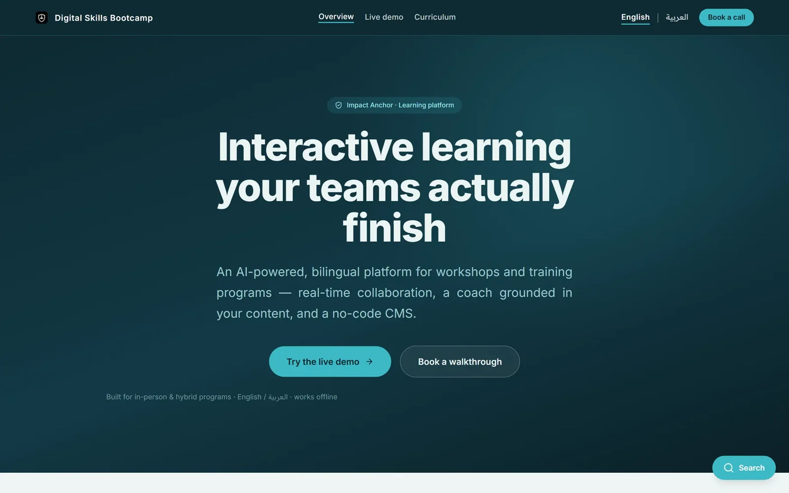
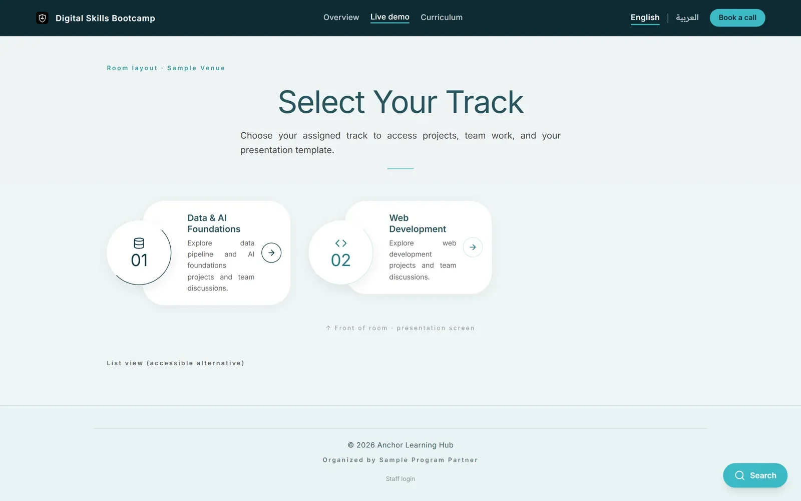

<b>Interactive, bilingual, offline-ready learning for workshops and training programmes</b>

تعلّم تفاعلي يُتمّه فريقك حتى النهاية

<b>Status:</b> Live demo · ready to deploy per client &nbsp;·&nbsp; <b>Built by</b> <a href="https://github.com/Mohanad1st">Mohannad Hesham</a>

> Case study only: the source is private because it is a product template built for client deployments. Walkthrough on request.

## The problem

Workshops end and the slides are forgotten. Most training platforms are either a slide deck with no interaction or a one-off custom build. This is a template a facilitator can re-skin for a new client in an afternoon: a shared workspace per table, live group work, and an AI coach grounded in the programme's own material.

## What it does

- Passcode-gated group workspaces where answers sync live across the table
- Multi-slide case studies, group exercises, timers and guided builders
- An AI coach that answers from the programme's own content, in English and Arabic
- Search across the programme in both languages
- A no-code content editor with revision history, and a feedback survey
- Keeps working offline in the room and syncs when the connection returns

## See it

**[Try the Anchor Learning Hub live demo](https://anchor-learning-hub.vercel.app)**

 Overview (English)

 Track selection in the live demo

All screens show demo data or public pages only.

## Built with

React · TypeScript · Tailwind CSS · PostgreSQL with realtime and serverless functions · static hosting

## Built responsibly

- Access codes are checked on the server and never kept in browser storage
- Separate permissions for running a session and editing content
- Row-level access rules are switched on by default; no independent security audit has been run on the template yet
- Content imports are validated against an allow-list before anything is written
- An automated check keeps English and Arabic text in step

## What it deliberately doesn't do

- The public demo uses sample content and illustrative AI replies; it is not connected to any client's data.

## More from Impact Anchor

- [ImpactAnchor Reels](https://github.com/Mohanad1st/impactanchor-reels-showcase) — Recorded sessions in; scored, subtitled, scheduled short videos out
- [Impact Anchor — consulting site](https://github.com/Mohanad1st/impact-anchor-site-showcase) — From AI overwhelm to a working adoption plan, for mission-driven teams
- [AI Governance Roadmap](https://github.com/Mohanad1st/ai-governance-roadmap-showcase) — A free course that takes you from first definitions to a working AI governance plan
- [Network Intelligence](https://github.com/Mohanad1st/network-intelligence-showcase) — Relationships, opportunities and content in one self-hosted workspace

---

© 2026 Mohannad Hesham. Showcase text and images only — no source code is published or licensed here. See all my work on <a href="https://github.com/Mohanad1st">my GitHub profile</a> · <a href="https://www.linkedin.com/in/mohannadhesham/">LinkedIn</a>.
